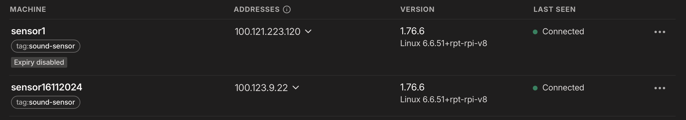

[TOC]

# General

1. Sensor Data Collection Node
2. Sensor Data Collection Server
3. Networking

## Data Collection Design


I had a few requirements for this design.

1. I wanted the design to be self-healing, allowing the sensor devices to adapt and respond to changing network conditions without requiring manual intervention. These devices would live on other people's networks that I couldn't control, so I didn't want to be responsible for their management.
2. I didn't want to complicate my networking setup or open unnecessary ports to the internet.
3. Since these devices would be deployed outdoors and potentially stolen, I prioritized data security and secrecy.

Here is a general summary of how everything works:

### Configuring the device with Tailscale

1. Create a Tailscale authentication key.
2. Associate the key with a tag (`sound-sensor`) to apply access control lists (ACLs).
3. Each device uses the `first_boot.service` to execute `first_boot.sh` on boot, which initializes Tailscale properly.

### Configuring Tailscale



I've been using Tailscale for a while now and have found it to be an excellent solution for my networking needs. Since my network was primarily used by me, I could keep it relatively flat, allowing all devices to communicate with each other freely. The boundary called `Docker Host` in the above diagram represents a Tailscale network that is isolated from the rest of the network and serves as the connection point to the internet and sensor data collection server.

Tailscale's access control policies are very well-designed. For example, you can define your tags like this:

```json
"tagOwners": {
  "tag:sound-sensor": ["autogroup:admin"],
  "tag:home":         ["autogroup:admin"],
  "tag:services":     ["autogroup:admin"],
},
```

and then isolate your devices with a simple rule like this:

```json
{
  "action": "accept",
  "src":    ["tag:sound-sensor"],
  "dst":    ["tag:services:65535"],
}
```

Note that I only run `Influxdb` on port `65535`. This effectively isolates all devices tagged as `sound-sensor` to only be able to send traffic to devices tagged `services` on port `65535`.

Out of convenience, I did allow my internal networks (e.g., my home network) to be able to talk to anything at any time. This also includes my `home` tagged devices being able to SSH into `sound-sensor` tagged devices.

```json
{
  "action": "accept",
  "src":    ["tag:home"],
  "dst":    ["*:*"],
}
```

#### Equipment

All of the sound meters deployed are the WS1361; however, I also purchased another sound meter with NIST certification to enhance the accuracy and validity of the readings.

[WS1361 Digital Sound Level Meter](https://a.co/d/eEE0PVq)
[Another Sensor with NIST Certification](https://a.co/d/aOY8Xfe)


## Reporting

The reporting is very simple Grafana dashboards that are self-explanatory. However, I wanted to expose the dashboards without exposing my network again.
For this purpose, I use a service called `dashoard/export.py`, which simply pushes my snapshots to https://snapshots.raintank.io on a cadence. Since the link/address changes, the script also updates metrics.html, which is fetched periodically by my public webhost.